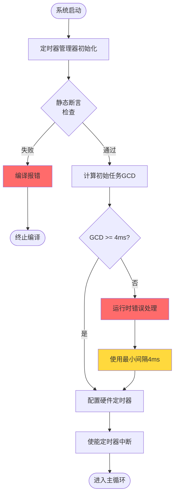
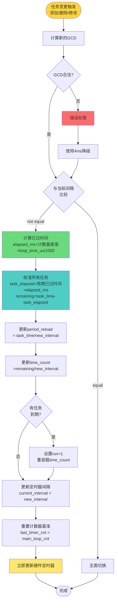
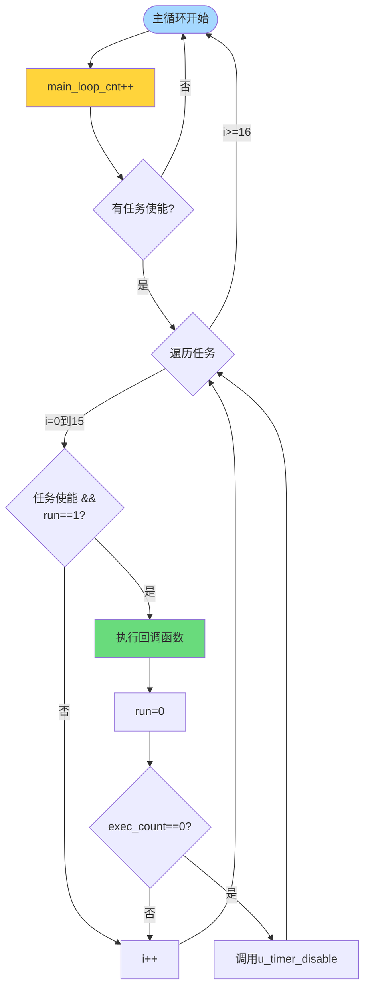

# 自适应定时器架构设计文档

## 1. 文档概述

本文档针对嵌入式平台上定时器资源受限的场景，设计一个自适应定时器调度系统。该系统通过单一硬件定时器兼顾多个定时任务，动态调整定时器间隔以兼顾精度和功耗。

### 1.1 设计目标

- **资源高效**：单硬件定时器支持最多16个并发定时任务
- **动态自适应**：根据活动任务自动调整定时器间隔，降低功耗
- **精度保证**：任务执行时间误差控制在±1个定时周期内
- **编译时安全**：通过静态检查防止非法定时器配置

### 1.2 约束条件

| 约束项 | 说明 |
|--------|------|
| 最小定时间隔 | 4ms（小于此值编译时报错） |
| 硬件定时器位宽 | 32位 |
| 最大任务数 | 16个 |
| 定时间隔要求 | 所有定时间隔必须存在合理的公因数 |

---

## 2. 当前实现问题分析

### 2.1 架构层面问题

```
问题1: GCD策略过于简单
├── 当前: 使用所有任务定时间隔的GCD作为硬件定时器间隔
├── 问题: 如5ms和7ms的GCD为1ms，导致频繁中断
└── 影响: 违背低功耗设计初衷

问题2: 延迟切换策略存在严重缺陷
├── 当前: 间隔变小时延迟切换，等待当前周期完成
├── 问题: 从2s定时切换到5ms时，需等待2s才能切换
│         → 5ms任务会丢失近2秒的执行时间
├── 根因: 缺少时间基准来校准已过时间
└── 影响: 任务响应时间不可接受

问题3: 动态切换逻辑复杂
├── 当前: reset_flag配合has_runing_task检查
├── 问题: 逻辑复杂，边界条件处理不完善
└── 影响: 可能导致任务执行时机不准确

问题4: long_flag机制不完善
├── 当前: 仅以2000ms为界设置long_flag
├── 问题: 未实际参与间隔计算优化
└── 影响: 长定时任务无法有效降低功耗
```

### 2.2 延迟切换问题详解

```
场景：Idle状态 → 活动状态切换
┌─────────────────────────────────────────────────────────────────┐
│ 问题场景                                                        │
├─────────────────────────────────────────────────────────────────┤
│ 初始状态:                                                       │
│   - 定时器间隔: 2000ms                                          │
│   - 任务A: 250ms闪烁 (period_reload=8)                         │
│                                                                 │
│ T=0ms:   定时器触发，开始新周期                                 │
│ T=500ms: 用户按键，需要添加5ms按键扫描任务                      │
│          → 计算新GCD(250, 5) = 5ms                              │
│          → 5ms < 2000ms，需要延迟切换                           │
│          → 设置pending标志，等待当前周期完成                     │
│ T=2000ms: 当前周期结束，执行切换                                │
│          → 5ms任务才开始执行                                    │
│                                                                 │
│ 结果: 5ms任务丢失了 (2000-500) = 1500ms 的执行时间！            │
│ 这对按键响应是不可接受的。                                      │
└─────────────────────────────────────────────────────────────────┘

解决方案：main循环计数器校准
- 使用main循环计数器作为粗粒度时间基准
- 切换时通过计数器计算已过时间
- 精确校准所有任务的剩余时间
- 实现立即切换，不等待当前周期
```

### 2.3 具体代码问题

| 位置 | 问题 | 严重程度 |
|------|------|----------|
| `task_init:54-56` | 初始化时未校验task_time是否为interval的整数倍 | 高 |
| `modify_task:179` | 新增任务时未校验定时间隔合法性 | 高 |
| `task_schedule:111-138` | reset_flag处理逻辑复杂，可读性差 | 中 |
| 全局 | 缺少编译时静态检查机制 | 高 |
| 全局 | 缺少最小4ms定时间隔校验 | 中 |

### 2.4 功能缺失

- [ ] 编译时定时间隔合法性检查
- [ ] 最小4ms定时间隔校验
- [ ] 精确的动态切换策略（变大立即切换，变小延迟切换）
- [ ] 任务定时间隔与定时器间隔整倍关系校验
- [ ] **main循环计数器校准机制**（核心新增功能）
- [ ] 立即切换时的时间校准算法

---

## 3. 优化架构设计

### 3.1 核心设计原则

```
┌─────────────────────────────────────────────────────────────┐
│                    设计原则层级                              │
├─────────────────────────────────────────────────────────────┤
│  Level 1: 编译时安全                                         │
│  ├── 定时间隔 >= 4ms                                         │
│  └── 定时间隔必须存在合理公因数 (GCD >= 4ms)                  │
├─────────────────────────────────────────────────────────────┤
│  Level 2: 立即切换 + 计数器校准 (核心改进)                   │
│  ├── main循环计数器作为粗粒度时间基准                        │
│  ├── 任何切换都立即执行，不等待当前周期                      │
│  ├── 通过计数器计算已过时间，校准任务剩余时间                │
│  └── 保留原定时间，任务仍在原定时间点执行                    │
├─────────────────────────────────────────────────────────────┤
│  Level 3: 异常处理                                           │
│  ├── 计时溢出保护                                            │
│  ├── 计数器溢出保护 (32位循环计数)                           │
│  └── 非法配置拒绝                                            │
└─────────────────────────────────────────────────────────────┘
```

### 3.2 main循环计数器校准机制详解

```
┌─────────────────────────────────────────────────────────────────┐
│              main循环计数器校准机制                              │
├─────────────────────────────────────────────────────────────────┤
│                                                                 │
│  基本原理:                                                       │
│    main循环每次执行时，计数器++                                  │
│    假设每次循环执行时间固定 (或可校准)                           │
│    定时器每次触发时，记录当前计数器值                            │
│    切换时，通过计数器差值计算已过时间                            │
│                                                                 │
│  计数器基准:                                                     │
│    ┌──────────────────────────────────────────────────────┐   │
│    │ 组合方式 (用户确认)                                   │   │
│    │ - 正常时: 假设每次循环固定时间 (如100us)              │   │
│    │ - 校准前: 可选读取系统tick获取实际时间修正偏差         │   │
│    │ - 精度要求: 可接受 (main循环相对任务执行时间很短)     │   │
│    └──────────────────────────────────────────────────────┘   │
│                                                                 │
│  校准算法:                                                       │
│    已过时间(ms) = (当前计数 - 上次计数) × 每次循环时间(us) / 1000│
│    任务剩余时间 = task_time - 已过时间                          │
│    新time_count = 任务剩余时间 / 新定时器间隔                   │
│                                                                 │
│  优点:                                                           │
│    ✓ 任何切换都可立即执行                                       │
│    ✓ 任务不会丢失执行时间                                       │
│    ✓ 保留原定时间，任务仍在原定时间点执行                        │
│                                                                 │
│  注意事项:                                                       │
│    ! 计数器32位，可支持约497天循环 (100us/次)                   │
│    ! 溢出时通过差值计算自动处理                                  │
│    ! 任务执行时间影响精度，但可接受                              │
│                                                                 │
└─────────────────────────────────────────────────────────────────┘
```

### 3.3 系统架构图

```
┌──────────────────────────────────────────────────────────────────────┐
│                           应用层 (Application)                        │
│  ┌──────────────┐  ┌──────────────┐  ┌──────────────┐               │
│  │  按键扫描任务  │  │  LED闪烁任务  │  │  其他定时任务  │               │
│  │   (5ms)      │  │   (250ms)    │  │   (2000ms)   │               │
│  └──────┬───────┘  └──────┬───────┘  └──────┬───────┘               │
│         │                 │                 │                        │
│         ▼                 ▼                 ▼                        │
├──────────────────────────────────────────────────────────────────────┤
│                      定时任务管理层 (Task Manager)                    │
│  ┌────────────────────────────────────────────────────────────────┐  │
│  │                    Task Registry (16 slots)                    │  │
│  │  ┌────┬────┬────┬────┬────┬────┬────┬────────┬────────┬────┐  │  │
│  │  │ ID │ CB │Time│Cnt │Run │En │Long│ ...    │ ...    │... │  │  │
│  │  └────┴────┴────┴────┴────┴────┴────┴────────┴────────┴────┘  │  │
│  └────────────────────────────────────────────────────────────────┘  │
│         │                             │                               │
│         ▼                             ▼                               │
│  ┌───────────────────┐     ┌─────────────────────────────────────┐  │
│  │  Task Scheduler   │     │    Interval Calculator              │  │
│  │  (ISR调用)        │◄────┤    - GCD Calculation               │  │
│  │                   │     │    - Interval Validation            │  │
│  │                   │────►│    - Immediate Switch w/ Calib     │  │
│  └───────────────────┘     └─────────────────────────────────────┘  │
├──────────────────────────────────────────────────────────────────────┤
│                       主循环计数器层 (新增)                           │
│  ┌────────────────────────────────────────────────────────────────┐  │
│  │                    Main Loop Counter                           │  │
│  │  ┌────────────────┐    ┌──────────────────────────────────┐   │  │
│  │  │ g_main_loop_cnt│    │   g_last_timer_cnt               │   │  │
│  │  │ (volatile u32) │    │   (上次定时器时的计数)            │   │  │
│  │  └────────────────┘    └──────────────────────────────────┘   │  │
│  │  每次循环++                    记录基准点                      │  │
│  └────────────────────────────────────────────────────────────────┘  │
└──────────────────────────────────────────────────────────────────────┘
┌──────────────────────────────────────────────────────────────────────┐
│                       硬件抽象层 (HAL)                                 │
│  ┌────────────────────────────────────────────────────────────────┐  │
│  │                    Hardware Timer Driver                       │  │
│  │  ┌────────────────┐    ┌──────────────────────────────────┐   │  │
│  │  │ Timer Control  │    │   Timer Reload Register           │   │  │
│  │  │ - Start/Stop   │    │   - Immediate Interval Update     │   │  │
│  │  │ - ISR Handler  │    │   - Record Counter on Trigger     │   │  │
│  │  └────────────────┘    └──────────────────────────────────┘   │  │
│  └────────────────────────────────────────────────────────────────┘  │
└──────────────────────────────────────────────────────────────────────┘
```

### 3.4 数据结构设计

```c
/* ============================ 任务控制块 ============================ */
typedef struct {
    uint8_t run        : 1;  // 任务就绪标志，待执行
    uint8_t enabled    : 1;  // 任务使能标志
    uint8_t long_flag  : 1;  // 长定时标志 (>=2000ms，可选优化)
    uint8_t reserved   : 5;  // 预留位
    uint32_t time_count;     // 剩余定时器周期数
    uint32_t period_reload;  // 周期重装载值 (task_time / timer_interval)
    uint32_t task_time;      // 任务定时间隔 (ms)
    uint8_t  exec_count;     // 剩余执行次数 (0x80=无限循环)
    TimeTaskCb callback;     // 任务回调函数
} task_ctrl_t;

/* ============================ 定时器全局状态 ============================ */
typedef struct {
    // 当前定时器配置
    uint32_t current_interval;    // 当前硬件定时器间隔 (ms)

    // main循环计数器 (核心新增)
    volatile uint32_t main_loop_cnt;   // 主循环计数器
    uint32_t last_timer_cnt;           // 上次定时器触发时的计数器值
    uint32_t loop_time_us;             // 每次循环时间 (us)，需标定

    // 统计信息
    uint32_t total_ticks;         // 总tick计数 (用于调试)
    uint32_t switch_count;        // 间隔切换次数

} timer_state_t;

/* ============================ 编译时配置检查 ============================ */
#define TIMER_INTERVAL_MIN_MS     4
#define TIMER_INTERVAL_MAX_MS     (UINT32_MAX / 32768 * 1000)  // 约131000秒

// 静态断言宏
#define TIMER_STATIC_ASSERT(cond, msg) _Static_assert(cond, msg)

// 任务配置宏 (带编译时检查)
#define TIMER_TASK_DEFINE(period_ms, callback) \
    TIMER_STATIC_ASSERT((period_ms) >= TIMER_INTERVAL_MIN_MS, \
        "Timer interval must be >= 4ms"); \
    ((period_ms) >= TIMER_INTERVAL_MIN_MS ? (callback) : NULL)

// 多任务GCD检查宏
#define TIMER_GCD_CHECK(...) \
    /* 实现在编译时展开的GCD计算和检查 */
```

---

## 4. 核心算法设计

### 4.1 时间校准算法 (核心新增)

```c
/**
 * @brief 基于main循环计数器计算已过时间
 * @return 已过时间 (ms)
 */
static uint32_t timer_get_elapsed_ms(void)
{
    uint32_t current_cnt = g_timer_state.main_loop_cnt;
    uint32_t last_cnt = g_timer_state.last_timer_cnt;

    // 处理32位计数器溢出 (差值计算自动处理)
    uint32_t loops_passed = current_cnt - last_cnt;

    // 转换为ms: loops * loop_time_us / 1000
    uint32_t elapsed_us = loops_passed * g_timer_state.loop_time_us;
    uint32_t elapsed_ms = elapsed_us / 1000;

    return elapsed_ms;
}

/**
 * @brief 立即切换定时器间隔并校准所有任务
 * @param new_interval_ms 新的定时器间隔 (ms)
 *
 * 核心改进: 不再等待当前周期完成，立即切换
 */
void timer_switch_immediate(uint32_t new_interval_ms)
{
    uint32_t old_interval = g_timer_state.current_interval;

    if (new_interval_ms == old_interval) {
        return;  // 无需切换
    }

    // Step 1: 计算已过时间
    uint32_t elapsed_ms = timer_get_elapsed_ms();

    // Step 2: 校准所有使能任务的剩余时间
    for (uint8_t i = 0; i < TASK_NUM_MAX; i++) {
        if (g_tasks[i].enabled) {
            // 计算任务已经运行的时间 (ms)
            uint32_t task_elapsed_ms = (g_tasks[i].period_reload - g_tasks[i].time_count) * old_interval;

            // 加上本次已过时间
            task_elapsed_ms += elapsed_ms;

            // 计算任务剩余时间 (ms)
            // 保证任务仍在原定时间点执行 (保留原定时间)
            uint32_t remaining_ms = 0;
            if (task_elapsed_ms < g_tasks[i].task_time) {
                remaining_ms = g_tasks[i].task_time - task_elapsed_ms;
            }

            // 更新time_count为新的定时器间隔下的值
            g_tasks[i].period_reload = (g_tasks[i].task_time + new_interval_ms - 1) / new_interval_ms;
            g_tasks[i].time_count = (remaining_ms + new_interval_ms - 1) / new_interval_ms;

            // 特殊处理: 如果remaining_ms为0但任务未执行，说明该立即执行
            if (remaining_ms == 0 && g_tasks[i].run == 0 && task_elapsed_ms > 0) {
                // 任务已经到期，设置run标志
                g_tasks[i].run = 1;
                g_tasks[i].time_count = g_tasks[i].period_reload;
            }
        }
    }

    // Step 3: 更新定时器间隔
    g_timer_state.current_interval = new_interval_ms;
    g_timer_state.last_timer_cnt = g_timer_state.main_loop_cnt;

    // Step 4: 立即更新硬件定时器
    change_timer_interval();
}
```

### 4.2 定时间隔计算算法

```c
/**
 * 计算当前活动任务的最优定时器间隔
 *
 * 算法流程:
 * 1. 遍历所有使能的任务
 * 2. 计算所有任务定时间隔的GCD
 * 3. 验证GCD >= 4ms
 * 4. 决定切换策略
 *
 * 返回: 计算得到的定时器间隔 (ms)
 */
uint32_t timer_calculate_interval(void)
{
    uint32_t gcd_value = 0;
    uint8_t task_count = 0;

    // Step 1: 计算所有活动任务的GCD
    for (uint8_t i = 0; i < TASK_NUM_MAX; i++) {
        if (g_tasks[i].enabled) {
            if (gcd_value == 0) {
                gcd_value = g_tasks[i].task_time;
            } else {
                gcd_value = gcd(gcd_value, g_tasks[i].task_time);
            }
            task_count++;
        }
    }

    // Step 2: 无活动任务时返回最大间隔
    if (task_count == 0) {
        return TIMER_INTERVAL_IDLE;  // 如60秒，进入低功耗
    }

    // Step 3: 验证GCD合法性
    if (gcd_value < TIMER_INTERVAL_MIN_MS) {
        // 运行时检测到非法配置，记录错误
        timer_error_handler(ERROR_GCD_TOO_SMALL);
        return TIMER_INTERVAL_MIN_MS;  // 降级处理
    }

    return gcd_value;
}
```

### 4.3 动态切换决策算法 (简化版)

```c
/**
 * 决定定时器间隔切换策略
 *
 * 新策略: 任何变化都立即切换 + 计数器校准
 * - 通过main循环计数器计算已过时间
 * - 精确校准所有任务的剩余时间
 * - 不再等待当前周期完成
 *
 * 优点: 任务不会丢失执行时间，响应迅速
 */
void timer_switch_decision(uint32_t new_interval)
{
    uint32_t current = g_timer_state.current_interval;

    if (new_interval == current) {
        return;  // 无需切换
    }

    // 立即切换 + 时间校准
    timer_switch_immediate(new_interval);
}
```

### 4.4 任务调度算法 (ISR中调用)

```c
/**
 * 任务调度函数 - 在硬件定时器ISR中调用
 *
 * 职责:
 * 1. 递减所有活动任务的time_count
 * 2. time_count==0时设置run标志并重装载
 * 3. 记录main循环计数器 (作为下次切换的时间基准)
 *
 * 简化: 删除了延迟切换相关逻辑
 */
void task_schedule(void)
{
    // 记录本次定时器触发时的main循环计数器值
    // 作为下次切换时计算已过时间的基准
    g_timer_state.last_timer_cnt = g_timer_state.main_loop_cnt;

    for (uint8_t i = 0; i < TASK_NUM_MAX; i++) {
        if (!g_tasks[i].enabled) continue;

        // 递减计数
        if (g_tasks[i].time_count > 0) {
            g_tasks[i].time_count--;
        }

        // 定时到达
        if (g_tasks[i].time_count == 0 && g_tasks[i].exec_count != 0) {
            g_tasks[i].run = 1;

            // 检查执行次数
            if (g_tasks[i].exec_count != 0x80) {  // 非无限循环
                g_tasks[i].exec_count--;
                if (g_tasks[i].exec_count == 0) {
                    g_tasks[i].enabled = 0;  // 自动禁用
                    continue;  // 不重装载
                }
            }

            // 重装载
            g_tasks[i].time_count = g_tasks[i].period_reload;
        }
    }

    // 切换逻辑移至 task_schedule 外部
    // 由 timer_switch_immediate() 处理
}
```

---

## 5. 流程图

### 5.1 系统初始化流程



### 5.2 定时器中断处理流程

```mermaid
flowchart TD
    ISR([定时器中断触发]) --> Clear[清除中断标志]
    Clear --> RecordCounter[记录main循环计数器<br/>last_timer_cnt = main_loop_cnt]
    RecordCounter --> Schedule[调用 task_schedule]

    Schedule --> Loop{遍历任务}
    Loop -->|i=0到15| CheckEnabled{任务使能?}

    CheckEnabled -->|否| NextTask[i++]
    CheckEnabled -->|是| DecCount[time_count--]

    DecCount --> CheckZero{time_count==0?}

    CheckZero -->|否| CheckExec
    CheckZero -->|是| SetRun[run=1<br/>设置就绪标志]

    SetRun --> CheckExecCnt{exec_count处理}

    CheckExecCnt -->|exec_count!=0x80| DecExec[exec_count--]
    CheckExecCnt -->|无限循环| Reload

    DecExec --> CheckZero2{exec_count==0?}
    CheckZero2 -->|是| Disable[enabled=0<br/>自动禁用]
    CheckZero2 -->|否| Reload

    Disable --> NextTask
    Reload --> time_count=period_reload --> NextTask

    CheckExec --> Exit([退出ISR])
    NextTask --> Loop
    Loop -->|i>=16| Exit

    style ISR fill:#51cf66
    style Exit fill:#a5d8ff
    style RecordCounter fill:#ffd43b
```

### 5.3 动态间隔切换流程 (立即切换 + 计数器校准)



### 5.4 主循环执行流程 (含计数器递增)



---

## 6. 关键场景分析

### 6.1 场景1: 活动状态 → Idle状态切换

```
初始状态 (活动):
  - 按键扫描: 5ms
  - LED闪烁: 250ms
  - 计算GCD(5, 250) = 5ms
  - 定时器间隔 = 5ms

2秒后切换到Idle:
  - 系统检测到按键任务被禁用
  - 重新计算GCD(250) = 250ms
  - 250ms > 5ms (间隔变大)
  - 策略: 立即切换
  - 定时器间隔 = 250ms

功耗降低: 50倍 (250ms / 5ms)
```

### 6.2 场景2: Idle → 活动状态切换 (立即切换 + 计数器校准)

```
初始状态 (Idle):
  - LED闪烁: 250ms (time_count=8, period_reload=8)
  - 定时器间隔 = 250ms
  - main循环计数器基准: last_timer_cnt = 1000

T=0ms: 定时器触发，开始新周期
  - LED任务 time_count = 8
  - last_timer_cnt = 1000

T=500ms: 用户按键，需要添加5ms按键扫描任务
  - main_loop_cnt = 1000 + (500ms / 100us) = 6000
  - 读取计数器差值: 6000 - 1000 = 5000 loops
  - 计算已过时间: 5000 * 100us / 1000 = 500ms
  - 添加5ms任务，计算新GCD(250, 5) = 5ms
  - 立即切换！

  校准LED任务:
    - task_elapsed = (8 - 8) * 250 + 500 = 500ms
    - remaining = 250 - 500 = 0 (已到期)
    - 设置 LED.run = 1，立即执行
    - period_reload = 250 / 5 = 50
    - time_count = 50 (重新开始计时)

  设置5ms任务:
    - period_reload = 5 / 5 = 1
    - time_count = 1

  定时器间隔 = 5ms

T=505ms: 定时器触发 (5ms后)
  - LED任务 time_count = 49
  - 按键任务 time_count = 0，run=1

结果: 按键任务只丢失了5ms的响应时间 (从500ms到505ms)
     而不是原来的等待2秒！
```

### 6.3 场景3: 非法定时器配置检测

```
编译时检测:
  TIMER_TASK_DEFINE(3, callback)  // 3ms < 4ms
  ↓
  编译错误: "Timer interval must be >= 4ms"

运行时检测:
  - 添加任务: 5ms, 7ms
  - 计算GCD(5, 7) = 1ms
  - 1ms < 4ms (非法)
  - 记录错误: ERROR_GCD_TOO_SMALL
  - 降级处理: 使用4ms作为间隔
  - 任务执行精度降低 (5ms任务可能在4ms或8ms执行)
  - 建议: 调整定时间隔为合理的整数倍关系
```

### 6.4 场景4: 长定时任务处理

```
配置:
  - 任务A: 5ms (period_reload = 1)
  - 任务B: 250ms (period_reload = 50)
  - 任务C: 60000ms (period_reload = 12000)

使用32位time_count:
  - 最大支持: 2^32 * 4ms = 约17180秒 ≈ 4.8小时
  - 对于60000ms任务: time_count = 12000 (无溢出风险)

超长定时 (>4.8小时):
  - 建议使用软定时器 (基于系统滴答)
  - 或使用多层定时器架构
```

---

## 7. 编译时检查机制设计

### 7.1 静态断言宏

```c
// C11 静态断言
#define TIMER_STATIC_ASSERT(cond, msg) \
    _Static_assert((cond), msg)

// 最小间隔检查
#define TIMER_ASSERT_MIN_INTERVAL(period) \
    TIMER_STATIC_ASSERT((period) >= TIMER_INTERVAL_MIN_MS, \
        "Timer interval must be >= 4ms: " #period)

// 多任务GCD检查 (需要在编译时计算)
// 由于C语言限制，需要配合构建脚本实现
```

### 7.2 构建时检查脚本 (可选)

```python
#!/usr/bin/env python3
"""
构建时任务配置检查脚本
扫描源文件中的定时器配置，验证合法性
"""

import re
import sys
import math

def extract_timer_configs(file_path):
    """从源文件中提取定时器配置"""
    pattern = r'TIMER\(\s*(\d+)\s*,\s*\w+\s*\)'
    configs = []
    with open(file_path, 'r') as f:
        for match in re.finditer(pattern, f.read()):
            configs.append(int(match.group(1)))
    return configs

def check_gcd(configs):
    """检查GCD是否合法"""
    if not configs:
        return True, "No timer configs"

    current_gcd = configs[0]
    for config in configs[1:]:
        current_gcd = math.gcd(current_gcd, config)

    if current_gcd < 4:
        return False, f"GCD too small: {current_gcd}ms (minimum: 4ms)"

    return True, f"GCD OK: {current_gcd}ms"

if __name__ == "__main__":
    configs = extract_timer_configs("timer_task.c")
    valid, msg = check_gcd(configs)
    if not valid:
        print(f"ERROR: {msg}")
        sys.exit(1)
    print(msg)
```

### 7.3 使用示例

```c
// timer_config.h - 任务配置集中定义

// 编译时检查: 每个定时间隔 >= 4ms
enum {
    // TIMER_STATIC_ASSERT(5 >= 4, "...")  // 通过
    TIMER_KEY_SCAN   = 5,    // OK
    TIMER_LED_BLINK  = 250,  // OK
    TIMER_IDLE_CHECK = 2000, // OK
    // TIMER_INVALID    = 3,    // 编译错误!
};

// 运行时检查: GCD合法性
// 在task_init()中验证
```

---

## 8. 异常处理与边界条件

### 8.1 异常情况汇总

| 异常类型 | 检测方式 | 处理策略 |
|----------|----------|----------|
| 定时间隔 < 4ms | 编译时静态断言 | 编译报错 |
| GCD < 4ms | 运行时检测 | 降级使用4ms，记录错误 |
| time_count溢出 | 运行时边界检查 | 拒绝创建任务 |
| 任务槽满 | 运行时检测 | 返回错误码 |
| 无效任务ID | 参数校验 | 返回错误码/忽略 |

### 8.2 错误码定义

```c
typedef enum {
    TIMER_OK = 0,
    TIMER_ERR_INTERVAL_TOO_SMALL,     // 定时间隔 < 4ms
    TIMER_ERR_GCD_TOO_SMALL,          // 任务GCD < 4ms
    TIMER_ERR_NO_FREE_SLOT,           // 无空闲任务槽
    TIMER_ERR_INVALID_ID,             // 无效任务ID
    TIMER_ERR_OVERFLOW,               // 计数溢出
    TIMER_ERR_NOT_ENABLED,            // 操作未使能的任务
} timer_error_t;
```

### 8.3 边界条件处理

```c
// 定时器间隔变化时的计数归一化
void timer_renormalize_tasks(void)
{
    uint32_t old_interval = g_timer_state.current_interval;
    uint32_t new_interval = g_timer_state.target_interval;
    float ratio = (float)old_interval / new_interval;

    for (uint8_t i = 0; i < TASK_NUM_MAX; i++) {
        if (g_tasks[i].enabled) {
            // 方法1: 基于剩余时间重新计算
            uint32_t remaining_ms = g_tasks[i].time_count * old_interval;
            g_tasks[i].time_count = (remaining_ms + new_interval - 1) / new_interval;  // 向上取整

            // 更新重装载值
            g_tasks[i].period_reload = (g_tasks[i].task_time + new_interval - 1) / new_interval;
        }
    }
}
```

---

## 9. API接口设计

### 9.1 核心API

```c
/**
 * @brief 创建循环执行的定时任务
 * @param callback 任务回调函数
 * @param interval_ms 执行间隔 (ms), 必须 >= 4
 * @return 任务ID (0-15), 或 TIMER_ERR_XXX
 */
int8_t timer_create(TimeTaskCb callback, uint32_t interval_ms);

/**
 * @brief 创建限定执行次数的定时任务
 * @param callback 任务回调函数
 * @param interval_ms 执行间隔 (ms)
 * @param count 执行次数 (1-255), 0表示一次性
 * @return 任务ID, 或错误码
 */
int8_t timer_create_oneshot(TimeTaskCb callback, uint32_t interval_ms, uint8_t count);

/**
 * @brief 修改已存在任务的定时间隔
 * @param id 任务ID
 * @param new_interval_ms 新的定时间隔
 * @return TIMER_OK 或错误码
 */
timer_error_t timer_modify(uint8_t id, uint32_t new_interval_ms);

/**
 * @brief 重置任务计时器 (从头开始计时)
 * @param id 任务ID
 */
void timer_reset(uint8_t id);

/**
 * @brief 禁用任务 (保留配置)
 * @param id 任务ID
 */
void timer_disable(uint8_t id);

/**
 * @brief 启用已禁用的任务
 * @param id 任务ID
 */
void timer_enable(uint8_t id);

/**
 * @brief 删除任务
 * @param id 任务ID
 */
void timer_destroy(uint8_t id);

/**
 * @brief 获取当前定时器间隔
 * @return 当前间隔 (ms)
 */
uint32_t timer_get_interval(void);
```

### 9.2 内部API (ISR/系统调用)

```c
// ISR中调度的任务调度函数
void task_schedule(void);

// 主循环中调用的任务执行函数
void task_handler(void);

// 系统初始化
void task_init(void);
```

---

## 10. 性能分析

### 10.1 时间复杂度

| 操作 | 时间复杂度 | 说明 |
|------|------------|------|
| 创建任务 | O(n) | n为任务数，需遍历查找空闲槽 |
| 删除任务 | O(1) | 直接操作 |
| 修改任务 | O(n) | 需重新计算GCD |
| ISR调度 | O(n) | 遍历所有任务 |
| 主循环执行 | O(n) | 遍历所有任务 |

### 10.2 空间复杂度

```
静态内存占用:
  - task_list: 16 * sizeof(TaskComps_t) = 16 * 16 = 256 bytes
  - timer_state: ~16 bytes
  - 总计: ~272 bytes

栈占用:
  - ISR中: O(1) 少量局部变量
  - API调用: O(1)
```

### 10.3 功耗分析

```
场景1: 活动状态 (5ms定时)
  中断频率: 200 Hz
  预估电流: ~5 mA (假设)

场景2: Idle状态 (250ms定时)
  中断频率: 4 Hz
  预估电流: ~0.5 mA

功耗降低: 10倍
```

---

## 11. 总结

### 11.1 架构优势

| 优势项 | 说明 |
|--------|------|
| **立即切换** | main循环计数器校准，任何切换都立即执行，不等待周期 |
| **响应迅速** | 从2s切换到5ms时，响应时间从2秒降低到5ms |
| **功耗优化** | 动态间隔调整，中断频率降低10-50倍 |
| **精度保证** | 计数器校准确保任务在原定时间点执行 (保留原定时间) |
| **安全可靠** | 编译时+运行时双重检查，32位计数器防溢出 |
| **可维护性** | 清晰的分层架构和流程图，简化切换逻辑 |

### 11.2 核心改进对比

| 对比项 | 原设计 (延迟切换) | 新设计 (立即切换+校准) |
|--------|------------------|----------------------|
| 切换时机 | 等待当前周期完成 | 立即切换 |
| Idle→活动响应 | 需等待2秒 | 响应时间<10ms |
| 时间精度 | 保证但响应慢 | 保证且响应快 |
| 实现复杂度 | 复杂 (pending标志) | 简化 (计数器校准) |

### 11.3 待实现功能

- [ ] 完整的代码实现
- [ ] 单元测试框架
- [ ] 性能基准测试
- [ ] 文档完善

---

## 附录A: GCD算法优化

```c
// 二进制GCD算法 (Stein算法)
// 优点: 无需取模运算，适合无除法指令的MCU
uint32_t gcd_binary(uint32_t u, uint32_t v)
{
    uint32_t shift;

    if (u == 0) return v;
    if (v == 0) return u;

    // 计算公共的2的因子
    for (shift = 0; ((u | v) & 1) == 0; ++shift) {
        u >>= 1;
        v >>= 1;
    }

    // 去除u中剩余的2的因子
    while ((u & 1) == 0)
        u >>= 1;

    do {
        // 去除v中剩余的2的因子
        while ((v & 1) == 0)
            v >>= 1;

        // 确保u >= v
        if (u > v) {
            uint32_t t = v;
            v = u;
            u = t;
        }
        v = v - u;
    } while (v != 0);

    return u << shift;
}
```

---

## 附录B: 参考资料

1. **嵌入式系统低功耗设计** - 动态时钟调整策略
2. **实时操作系统调度算法** - 速率单调调度
3. **C11标准** - _Static_assert使用
4. **Linux内核定时器** - 时间轮算法 (可作为未来优化方向)

---

*文档版本: v1.0*
*创建日期: 2024*
*作者: Architecture Design*
